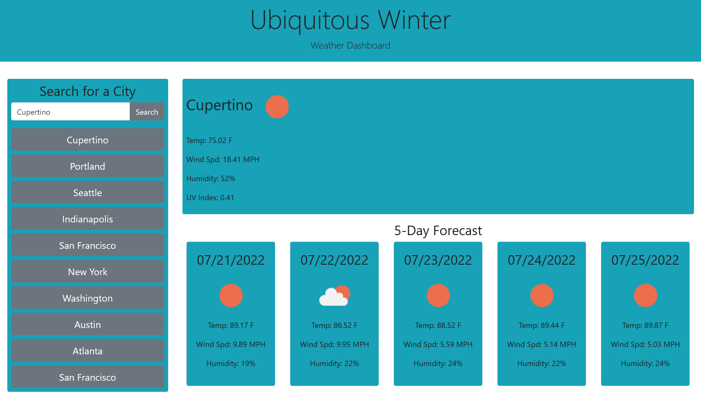

# Ubiquitous Weather - A Weather Dashboard
A weather dashboard to help people check in on other cities

Description 
====
A weather dashboard that shows the current weather and a five-day forecast for a given city. It remembers the user's 10 more recently searched cities, so they can easily keep tabs on multiple areas.

To use, simply enter a city name and click search to have the weather data show on the right-hand side of the page. Alternately, click a recently searched city to show data for that city.

Demo
=====
Here's a live deployed version of the scheduler: [https://kurtbixby.github.io/ubiquitous-winter-weather-dashboard/](https://kurtbixby.github.io/ubiquitous-winter-weather-dashboard/).

Credits
=====
__[Kurt Bixby](https://github.com/kurtbixby)__ wrote the JavaScript, CSS, and HTML from scratch.

Favicon sourced from [IconArchive](https://iconarchive.com/show/papirus-apps-icons-by-papirus-team/weather-icon.html).

## Collaborators
__David T__ helped me find the weather icons.
